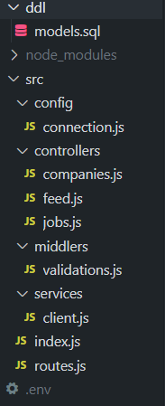

# Backend Developer Technical Assessment


## Assessment Overview

It is with great pleasure and happiness that I submit my challenge, done with a lot of dedication and commitment. A NodeJS API was developed for a job posting management application. Analyzing application details and use cases and converting them into functional endpoints.

## Source code



`src`: The base folder, contains all the project development scripts

`index.js`: The Express server entry point.

`routes.js`: Defines the API routes and their controllers.

`middlers`: Contains the validation file, where some job validations are performed
   
`controllers`: where the main endpoints are located and perform tasks coming from my routes
   
 `config`: Folder reserved for configuring my variables, my connection to the database.
 
`dll`: storage of the database creation code and its tables.

`.env` contains my environment variables, it must be configured using the example below so that it works perfectly

        - Server port
        PORT=
        
        - Connection with database
        DB_HOST=
        DB_USER=
        DB_PORT=
        DB_PASS=
        DB_NAME=

        - Connection with bucket
        KEY_ID=
        APP_KEY=
        BUCKET_NAME=
        ENDPOINT_BACKBLAZE=

        KEY_NAME=


## Technologies used

### - JavaScript  and Node.js
[](https://img.shields.io/badge/JavaScript-323330?style=for-the-badge&logo=javascript&logoColor=F7DF1E)
[](https://img.shields.io/badge/Node%20js-339933?style=for-the-badge&logo=nodedotjs&logoColor=white)

## Dependencies:

### express.js: 
Used to create web applications and APIs in Node.js. It is widely used to create web servers and simplify web development in Node.js. Run the following command to install: 
```javascript
npm install express
```

### nodemon: 
A development tool that monitors changes to files in the project directory and automatically restarts the server whenever there is a change. Packages used only during development. Run the following command to install: 
```javascript 
npm install -D nodemon
```

### dotenv:
Used for managing environment variables in the application. Run the following command: 
```javascript
npm install dotenv
```


### knex:
SQL query builder for Node.js which is used to interact with relational databases. Run the following command to install: 
```javascript
npm install knex
```

### pg: 
PostgreSQL client for Node.js. ecosystem, providing an interface applications to communicate with a PostgreSQL database. Run the following command to install: 
```javascript
npm install pg
```

### aws-sdk:
Simplifies the use of AWS Services by providing a set of consistent libraries and supports API lifecycle considerations such as credential management, retries, data marshaling, and serialization
```javascript
npm install aws-sdk
```

## Important
Some important points.

1. To develop the API and store my data, I used my local database, which means that if you are testing with a remote database, you may need SSL authentication, so you need to uncomment line 11 of the file `src/config/connection.js`

2. For practical and free use purposes, I chose to use the backblaze platform to create my bucket, which also supports AWS

## How to test

1. Clone the repository to your local machine

- [ ] Fork this repository to your GitHub
- [ ] Clone the project on your machine
- [ ] Once cloned on your machine, install the dependencies mentioned above and start the server using:
```javascript
npm run dev
```


2. To test this project, you will need to use software to generate HTTP requests. I used insomnia to carry out these tests.


### Endpoint Actions

- `GET /companies`: List existing companies.
- `GET /companies/:company_id`: Fetch a specific company by ID.
- `POST /job`: Create a job posting draft.
- `PUT /job/:job_id/publish`: Publish a job posting draft.
- `PUT /job/:job_id`: Edit a job posting draft (title, location, description).
- `DELETE /job/:job_id`: Delete a job posting draft.
- `PUT /job/:job_id/archive`: Archive an active job posting.
- `GET/feed`: endpoint to serve a job feed.


## Bonus Questions

1. One of the possible scalability solutions for the task moderation feature under high load conditions could be to distribute the workload across multiple instances of the serverless moderation component. This can be done by using load balancers to direct requests to different component instances. This way, you can scale horizontally by adding more instances as needed to handle increased traffic.

2. To deliver the jobs feed globally with sub-millisecond latency, you might consider deploying the application across multiple AWS regions to ensure it is close to users around the world. This allows users to connect to the nearest data center, reducing latency. Use services like Amazon Route 53 for geographic routing and Amazon DynamoDB Global Tables for cross-region data replication.

## Contact
I am available to clarify any doubts

[](https://www.linkedin.com/in/micheecelestin/)
[](https://wa.me/5547997768422)
